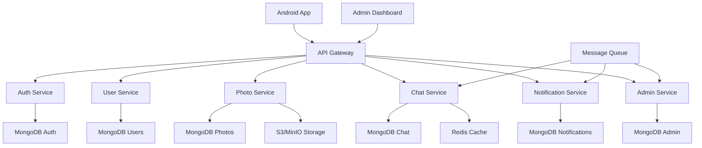

# Phone App Implementation Plan

## Project Overview
Modular, microservices-based location-based photo sharing and real-time chat application with containerized Node.js services and modular Android client.

## Architecture Principles
- **Microservices**: Independent, deployable services
- **Modular Android**: Feature-based modules with clean architecture
- **Event-Driven**: Asynchronous communication between services
- **Container-First**: Docker containers for all services
- **API-First**: Well-defined service contracts

## Core Features

### 1. Location Services
- [x] Display current latitude/longitude/nearest city and town
- [ ] Location-based photo tagging
- [ ] Nearby users discovery

### 2. User Authentication
- [ ] User registration (username, email, password)
- [ ] User login/logout
- [ ] Password reset via email
- [ ] JWT token authentication
- [ ] Secure password hashing

### 3. Photo Sharing
- [ ] Camera integration
- [ ] Photo upload with location data
- [ ] Photo gallery view
- [ ] 30-day automatic deletion
- [ ] Photo compression/optimization

### 4. Real-time Chat
- [ ] WebSocket connection
- [ ] Private messaging
- [ ] Chat rooms
- [ ] User blocking functionality
- [ ] Message history

### 5. User Profile
- [ ] Profile information management
- [ ] Password change
- [ ] Profile picture upload
- [ ] Account settings

### 6. Notifications
- [ ] In-app notifications
- [ ] Push notifications
- [ ] Notification preferences

### 7. Settings & Preferences
- [ ] App preferences
- [ ] Privacy settings
- [ ] Language selection
- [ ] Theme selection

### 8. Administrative System
- [ ] Role-based access control (User, Moderator, Admin)
- [ ] User management and moderation
- [ ] Content moderation (photos, messages)
- [ ] System analytics and reporting
- [ ] Audit logging and compliance
- [ ] Administrative dashboard (web-based)
- [ ] Bulk operations and system maintenance

## Technical Implementation

### Android App (Modular Kotlin)
- **Architecture**: Clean Architecture + MVVM
- **Modules**: Feature-based (auth, photos, chat, profile, location)
- **DI**: Hilt for dependency injection
- **Networking**: Retrofit2 + OkHttp with interceptors
- **Image Loading**: Glide with caching
- **Real-time**: WebSocket/Socket.IO client
- **Location**: Google Play Services
- **Database**: Room for local caching
- **Navigation**: Navigation Component
- **Testing**: JUnit + Espresso + Mockito

### Backend Microservices (Node.js + TypeScript)

#### Auth Service
- **Framework**: Express.js + TypeScript
- **Database**: MongoDB (users, sessions)
- **Authentication**: JWT + OAuth2 + bcrypt
- **Features**: Registration, login, token refresh, password reset

#### Photo Service
- **Framework**: Express.js + TypeScript
- **Database**: MongoDB (photo metadata)
- **Storage**: AWS S3/MinIO for images
- **Features**: Upload, retrieval, location-based queries, expiration

#### Chat Service
- **Framework**: Express.js + Socket.IO + TypeScript
- **Database**: MongoDB (messages, rooms)
- **Real-time**: Socket.IO for WebSocket connections
- **Features**: Private messaging, rooms, user blocking

#### User Service
- **Framework**: Express.js + TypeScript
- **Database**: MongoDB (profiles, preferences)
- **Features**: Profile management, settings, user blocking

#### Notification Service
- **Framework**: Express.js + TypeScript
- **Database**: MongoDB (notifications)
- **Push**: Firebase Cloud Messaging
- **Email**: Nodemailer
- **Features**: In-app notifications, push notifications

#### Admin Service
- **Framework**: Express.js + TypeScript + React (dashboard)
- **Database**: MongoDB (admin logs, reports)
- **Authentication**: Enhanced JWT with role-based permissions
- **Features**: User management, content moderation, analytics, audit logs
- **Dashboard**: React-based web interface for administrators

### Infrastructure Components

#### API Gateway
- **Framework**: Kong/Nginx
- **Features**: Routing, rate limiting, authentication
- **Load Balancing**: Round-robin, health checks

#### Message Queue
- **Technology**: RabbitMQ/Redis
- **Purpose**: Inter-service communication
- **Patterns**: Pub/Sub, Work Queues

#### Monitoring Stack
- **Metrics**: Prometheus + Grafana
- **Logging**: ELK Stack (Elasticsearch, Logstash, Kibana)
- **Tracing**: Jaeger for distributed tracing

## Development Phases

### Phase 1: Infrastructure & Foundation (Week 1-2)
- [x] Project setup and modular structure
- [x] Basic location display (Android)
- [x] API stubs and models
- [ ] Docker containerization setup
- [ ] API Gateway configuration
- [ ] Service discovery setup
- [ ] Database per service design
- [ ] CI/CD pipeline foundation

### Phase 2: Core Services (Week 3-4)
- [ ] Auth Service implementation
- [ ] User Service implementation
- [ ] Photo Service (basic upload/retrieval)
- [ ] Android auth module
- [ ] Android photo module
- [ ] Service-to-service communication
- [ ] Basic API Gateway routing

### Phase 3: Real-time & Chat (Week 5-6)
- [ ] Chat Service with Socket.IO
- [ ] Android chat module
- [ ] WebSocket connection management
- [ ] Message queue integration
- [ ] User blocking functionality
- [ ] Real-time notifications

### Phase 4: Advanced Features (Week 7-8)
- [ ] Notification Service
- [ ] Photo expiration job (cron service)
- [ ] Location-based photo queries
- [ ] Android profile module
- [ ] Push notification integration
- [ ] File storage optimization

### Phase 4.5: Administrative System (Week 8-9)
- [ ] Admin Service implementation
- [ ] Role-based authentication system
- [ ] Administrative dashboard (React web app)
- [ ] User management and moderation tools
- [ ] Content moderation system
- [ ] System analytics and reporting
- [ ] Audit logging implementation

### Phase 5: Observability & Security (Week 10-11)
- [ ] Monitoring stack (Prometheus/Grafana)
- [ ] Centralized logging (ELK)
- [ ] Distributed tracing (Jaeger)
- [ ] Security hardening
- [ ] Data encryption
- [ ] Rate limiting and throttling
- [ ] Admin security controls and permissions

### Phase 6: Testing & Quality (Week 12-13)
- [ ] Unit testing (all services including admin)
- [ ] Integration testing
- [ ] Contract testing between services
- [ ] Android UI testing
- [ ] Admin dashboard testing
- [ ] Performance testing
- [ ] Security testing (including role-based access)

### Phase 7: Production Deployment (Week 14-15)
- [ ] Kubernetes deployment
- [ ] Production environment setup
- [ ] Load balancing configuration
- [ ] Backup and disaster recovery
- [ ] Monitoring alerts
- [ ] Admin dashboard deployment
- [ ] Documentation completion

## Security Requirements
- [ ] HTTPS/TLS encryption
- [ ] JWT token security
- [ ] Input validation
- [ ] SQL injection prevention
- [ ] XSS protection
- [ ] Rate limiting
- [ ] Secure file upload

## Performance Optimizations
- [ ] Image compression
- [ ] Lazy loading
- [ ] Data caching
- [ ] Connection pooling
- [ ] CDN integration
- [ ] Background sync

## Internationalization
- [ ] Multi-language support
- [ ] String resources
- [ ] RTL language support
- [ ] Locale-specific formatting

## Testing Strategy
- [ ] Unit tests (80% coverage)
- [ ] Integration tests
- [ ] UI automation tests
- [ ] API endpoint tests
- [ ] Performance tests
- [ ] Security tests

## Service Dependencies



## Deployment Strategy

### Development Environment
- [ ] Docker Compose for local development
- [ ] Hot reloading for all services
- [ ] Local databases and storage

### Staging Environment
- [ ] Kubernetes cluster (minikube/kind)
- [ ] Service mesh (Istio) for traffic management
- [ ] Automated testing pipeline

### Production Environment
- [ ] Kubernetes cluster (AWS EKS/GKE)
- [ ] Horizontal Pod Autoscaling
- [ ] Blue-green deployment strategy
- [ ] CDN for static assets
- [ ] Database clustering and replication

## Modular Development Benefits

### Independent Development
- Teams can work on different services simultaneously
- Faster development cycles
- Technology diversity (different frameworks per service)
- Easier onboarding for new developers

### Scalability
- Scale individual services based on demand
- Resource optimization per service
- Independent deployment and rollback
- Fault isolation

### Maintainability
- Smaller, focused codebases
- Clear service boundaries
- Easier testing and debugging
- Technology stack flexibility

## Risk Mitigation

### Technical Risks
- **Service Failures**: Circuit breakers, retries, fallbacks
- **Data Consistency**: Event sourcing, saga patterns
- **Network Issues**: Service mesh, load balancing
- **Security**: OAuth2, API keys, rate limiting

### Operational Risks
- **Monitoring**: Comprehensive observability stack
- **Deployment**: Automated CI/CD with rollback
- **Data Loss**: Regular backups, replication
- **Performance**: Load testing, auto-scaling

## Success Metrics

### Technical Metrics
- Service uptime (99.9% target)
- Response time (<200ms average)
- Error rate (<1%)
- Test coverage (>80%)

### Business Metrics
- User registration rate
- Daily active users
- Photo upload frequency
- Chat message volume
- App store ratings
- Feature adoption rates

## Implementation Checklist for AI Agents

### Prerequisites
- [ ] Node.js 18+ installed
- [ ] MongoDB 6+ running
- [ ] Redis 7+ running
- [ ] Docker and Docker Compose
- [ ] Android Studio with Kotlin support
- [ ] Git repository initialized
- [ ] **🚨 CRITICAL: Test suite dependencies installed (`cd tests && npm install`)**

### Phase 1 Implementation Steps
1. **Setup Project Structure**
   ```bash
   mkdir -p services/{auth,photo,chat,user,notification,admin}-service
   mkdir -p gateway shared infrastructure
   ```

2. **🚨 MANDATORY: Setup Test Suite First**
   ```bash
   cd tests
   npm install
   # Verify test suite works before implementing features
   npm test
   ```

3. **Initialize Each Service**
   ```bash
   cd services/auth-service
   npm init -y
   npm install express mongoose bcryptjs jsonwebtoken cors helmet
   ```

3. **Create Base Express Server** (each service)
   ```javascript
   // src/app.js template
   const express = require('express');
   const cors = require('cors');
   const helmet = require('helmet');
   
   const app = express();
   
   app.use(helmet());
   app.use(cors());
   app.use(express.json());
   
   // Routes
   app.use('/health', (req, res) => res.json({ status: 'ok' }));
   
   module.exports = app;
   ```

4. **Database Connection Template**
   ```javascript
   // src/config/database.js
   const mongoose = require('mongoose');
   
   const connectDB = async () => {
     try {
       await mongoose.connect(process.env.MONGODB_URI);
       console.log('MongoDB connected');
     } catch (error) {
       console.error('Database connection failed:', error);
       process.exit(1);
     }
   };
   
   module.exports = connectDB;
   ```

5. **JWT Middleware Template**
   ```javascript
   // src/middleware/auth.js
   const jwt = require('jsonwebtoken');
   
   const authenticateToken = (req, res, next) => {
     const authHeader = req.headers['authorization'];
     const token = authHeader && authHeader.split(' ')[1];
   
     if (!token) {
       return res.status(401).json({ 
         success: false, 
         error: { code: 'TOKEN_MISSING', message: 'Access token required' }
       });
     }
   
     jwt.verify(token, process.env.JWT_SECRET, (err, user) => {
       if (err) {
         return res.status(403).json({ 
           success: false, 
           error: { code: 'TOKEN_INVALID', message: 'Invalid token' }
         });
       }
       req.user = user;
       next();
     });
   };
   
   module.exports = { authenticateToken };
   ```

### Android Implementation Steps
1. **Setup Hilt Dependency Injection**
   ```kotlin
   // di/NetworkModule.kt
   @Module
   @InstallIn(SingletonComponent::class)
   object NetworkModule {
   
       @Provides
       @Singleton
       fun provideOkHttpClient(): OkHttpClient {
           return OkHttpClient.Builder()
               .addInterceptor(AuthInterceptor())
               .addInterceptor(HttpLoggingInterceptor().apply {
                   level = HttpLoggingInterceptor.Level.BODY
               })
               .build()
       }
   
       @Provides
       @Singleton
       fun provideRetrofit(okHttpClient: OkHttpClient): Retrofit {
           return Retrofit.Builder()
               .baseUrl("http://10.0.2.2:8080/api/")
               .client(okHttpClient)
               .addConverterFactory(GsonConverterFactory.create())
               .build()
       }
   }
   ```

2. **Repository Pattern Implementation**
   ```kotlin
   // features/auth/data/repository/AuthRepositoryImpl.kt
   @Singleton
   class AuthRepositoryImpl @Inject constructor(
       private val apiService: AuthApiService,
       private val preferencesManager: PreferencesManager
   ) : AuthRepository {
   
       override suspend fun login(username: String, password: String): AuthResponse {
           val request = LoginRequest(username, password)
           val response = apiService.login(request)
           
           if (response.isSuccessful) {
               response.body()?.let { authResponse ->
                   preferencesManager.saveAuthToken(authResponse.tokens.accessToken)
                   preferencesManager.saveUserId(authResponse.user.id)
                   return authResponse
               }
           }
           
           throw Exception("Login failed")
       }
   }
   ```

### Testing Implementation
1. **Service Unit Tests**
   ```javascript
   // tests/setup.js
   const { MongoMemoryServer } = require('mongodb-memory-server');
   const mongoose = require('mongoose');
   
   let mongoServer;
   
   beforeAll(async () => {
     mongoServer = await MongoMemoryServer.create();
     const mongoUri = mongoServer.getUri();
     await mongoose.connect(mongoUri);
   });
   
   afterAll(async () => {
     await mongoose.disconnect();
     await mongoServer.stop();
   });
   
   beforeEach(async () => {
     const collections = mongoose.connection.collections;
     for (const key in collections) {
       await collections[key].deleteMany({});
     }
   });
   ```

2. **Android Unit Tests**
   ```kotlin
   // features/auth/domain/usecase/LoginUseCaseTest.kt
   @ExtendWith(MockitoExtension::class)
   class LoginUseCaseTest {
   
       @Mock
       private lateinit var authRepository: AuthRepository
   
       private lateinit var loginUseCase: LoginUseCase
   
       @BeforeEach
       fun setup() {
           loginUseCase = LoginUseCase(authRepository)
       }
   
       @Test
       fun `login with valid credentials returns success`() = runTest {
           // Arrange
           val username = "testuser"
           val password = "password123"
           val expectedResponse = AuthResponse(/* mock data */)
           
           whenever(authRepository.login(username, password))
               .thenReturn(expectedResponse)
   
           // Act
           val result = loginUseCase(username, password)
   
           // Assert
           assertTrue(result.isSuccess)
           assertEquals(expectedResponse, result.getOrNull())
       }
   }
   ```

### Deployment Checklist
- [ ] **🚨 ALL TESTS PASS**: `npm test` returns 100% success
- [ ] **Test Coverage**: Minimum 80% code coverage verified
- [ ] **New Features Tested**: All new endpoints have corresponding tests
- [ ] **Test Documentation**: Updated test requirements and documentation
- [ ] Environment variables configured
- [ ] Database migrations ready
- [ ] Docker images built and tested
- [ ] Health check endpoints implemented
- [ ] Logging configured
- [ ] Monitoring dashboards created
- [ ] Load balancer configured
- [ ] SSL certificates installed
- [ ] Backup procedures tested
- [ ] Rollback procedures documentedurcing, saga patterns
- **Network Issues**: Service mesh, load balancing
- **Security**: OAuth2, API keys, rate limiting

### Operational Risks
- **Monitoring**: Comprehensive observability stack
- **Deployment**: Automated CI/CD with rollback
- **Data Loss**: Regular backups, replication
- **Performance**: Load testing, auto-scaling

## Success Metrics

### Technical Metrics
- Service uptime (99.9% target)
- Response time (<200ms average)
- Error rate (<1%)
- Test coverage (>80%)

### Business Metrics
- User registration rate
- Daily active users
- Photo upload frequency
- Chat message volume
- App store ratings
- Feature adoption rates